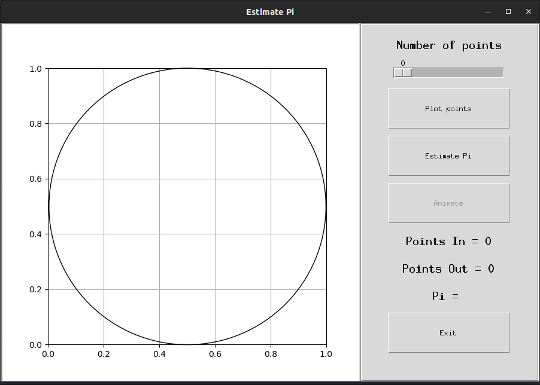

# Estimate-Pi

Monte Carlo methods, or Monte Carlo experiments, are a broad class of computational algorithms
that rely on repeated random sampling to obtain numerical results. The underlying concept is to
use randomness to solve problems that might be deterministic in principle. They are often used
in physical and mathematical problems and are most useful when it is difficult or impossible to
use other approaches. Monte Carlo methods are mainly used in three problem classes; optimization,
numerical integration, and generating draws from a probability distribution.

Link wiki: https://en.wikipedia.org/wiki/Monte_Carlo_method

Link article: https://medium.com/cantors-paradise/estimating-%CF%80-using-monte-carlo-simulations-3459a84b5ef9

This code is an interactive application that estimates the value of pi
using the unit square unit circle method.

Author: Harivinay

Github: github.com/M87K452b

Date: Feb 2021

Note: The animate function is yet to be implemented.

### How To: 
Just download and run. Use the slider to adjust the number of points.

Click 'Plot points' plot the generated random data.

Click 'Estimate Pi' to approixmate the value of Pi.

  

